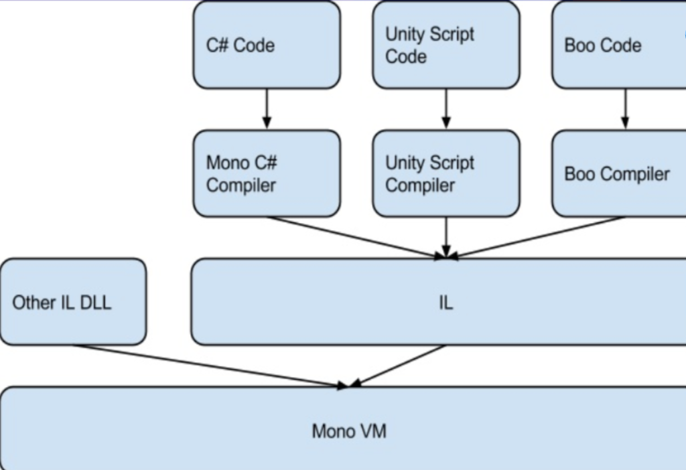
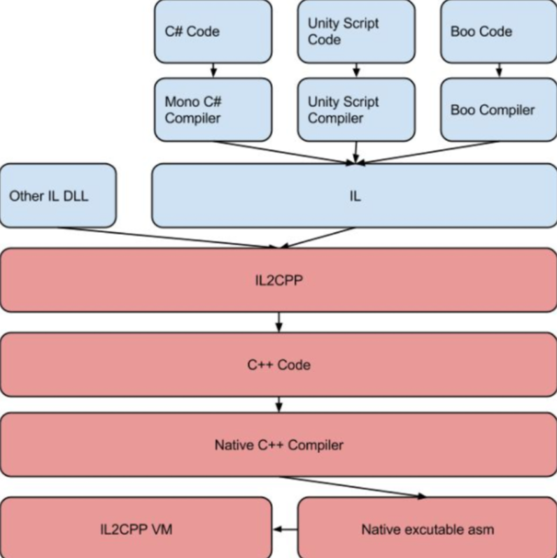

# 2024/3
## 关于Unity 引擎的跨平台原理
- <del>这里涉及Mono以及IL2PP的一些问题。</del>
- _CIL（Common Intermediate Language_）通用中间件语言。
---
---
### Mono的编译流程
&nbsp;&nbsp;首先，Mono已经可以做到跨平台，所有代码都会在Mono VM中运行。 
但是缺点是，Mono的各平台VM需要维护且Mono需运行在VM中会比原生CPP更慢。

### IL2PP的编译流程
&nbsp;&nbsp;在IL代码之后，再进行一次转译，将其转化为Cpp代码，然后再利用不同平台的优化过的编译器，编译为对于平台的目标代码。 

### UnityRuntime（运行时）
&nbsp;&nbsp;提供统一的Api和功能，驱动Unity运行时引擎的执行环境。

## 协程和线程
<del>以目前的粗鄙理解，线程是操作系统层面控制，协程是用户的应用层控制。协程终归还是归它的线程管。</del> 

- 首先需要理解并发，并行，串行的区别。
- 多个协程在一个线程里面并发的执行，起到类似多线程的并发作用。但是线程的调度和销毁需要依靠操作系统，太过耗时，而协程是轻量级的。

!!! warning ""
    当协程遇到阻塞IO时线程会被挂起，此时便无法再执行其他操作，所以做Socket编程相关的项目时，需要注意将IO转移到别的不会影响主线程的地方。
