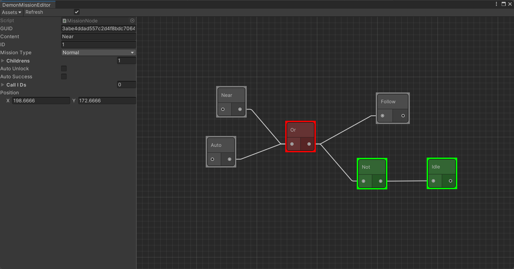

# 行为配置树

## Summary

以往的任务系统或者行为树等总体事件配置大多是使用ScriptableObject进行存储。但SO的方式存储并不好进行大批量的配置和调整，而很多任务采用了任务系统去一个监听的方式再去播放广播的一个方式,并且将图状结构直接关系树表示并不能做到离散化。所以笔者写了一个小工具，用于离散配置图状行为，并且序列化的字符串可以导入到Excel中。

## Github仓库
[链接](https://github.com/DemonViglu/DemonUnityUtil/tree/main/MissonUtil)

## 概览


- 如图，左边为`Inspector`窗口，用于观察具体的Node的数据，右边则为图状的节点蓝图。
- 节点的具体颜色则表示该节点的判断状态。如下表所示：
    | | |
    |:-:|:-:|
    |绿色|执行成功|
    |红色|执行失败|
    |黄色|正在执行|
    |灰色|节点未解锁|
    |白色|节点隐藏|

- 上图的简单行为配置可以通过直观的方式分析：当处于`靠近`状态或者`自动跟随`状态时，进行跟随。否则，静置。

- 蓝图的序列化文本数据如下
```
    任务编号	任务名	任务状态	节点类型	子节点	AutoUnlock	AutoSuccess	Call_ID	Position
    1	Near	Locked	Normal	3	FALSE	FALSE		198.6666,172.6666
    2	Auto	Locked	Normal	3	FALSE	FALSE		172.6667,297.3334
    3		Failure	Or	4,5	FALSE	FALSE		370.6666,259.3334
    5		Success	Not	6	FALSE	FALSE		548.6667,352
    4	Follow	Locked	Normal		FALSE	TRUE		596,188.67
    6	Idle	Success	Normal		FALSE	TRUE		722.6666,351.3333
```

- 上述蓝图的代码调用
``` csharp
        private void LogicJudge()
    {
        //If Player Near
        if (Vector3.Distance(PlayerOBJ.transform.position, transform.position) < 3)
        {
            if (MNM.GetMissionNode(1).State != MissionState.Success) MNM.MakeProgress(1);
        }
        else MNM.MakeMissionLock(1);

        //If Auto Follow
        if (AutoFollow)
        {
            if (MNM.GetMissionNode(2).State != MissionState.Success) MNM.MakeProgress(2);
        }
        else MNM.MakeMissionLock(2);
    }

    private void Action()
    {
        //If Can Follow
        if(MNM.GetMissionNode(4).State == MissionState.Success)
        {
            Debug.Log("Should Follow");
        }
        //If Should Idle
        if(MNM.GetMissionNode(6).State == MissionState.Success)
        {
            Debug.Log("Idling");
        }
    }
}
```

## 具体实现逻辑

### Node 的实现

